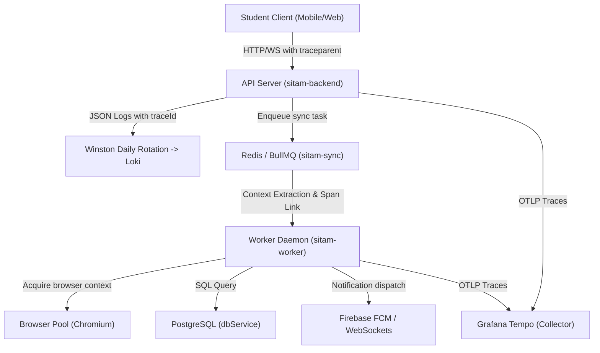

# SITAM Smart ERP — OpenTelemetry & Tempo Setup Manual

This document provides architectural design, installation, and deployment documentation for distributed tracing across the SITAM Smart ERP platform.

---

## 1. Observability Architecture



---

## 2. Core OpenTelemetry Setup

OpenTelemetry is bootstrapped natively via the Node SDK inside `backend/telemetry/tracing.js`. It runs monkey-patches on:
* `http` and `https` modules
* `express` routes and middlewares
* `pg` (PostgreSQL Client queries)
* `ioredis` (Redis command telemetry)

### Boot Sequence
Tracing MUST be initialized before any other imports. To guarantee this, the very first line of `server.js` and `worker.js` requires:
```javascript
require('./telemetry/tracing');
```

---

## 3. Tempo Docker Integration

The Tempo service runs inside our Docker Compose stack, exposed on the following ports:
* `4317` — OTLP gRPC ingestion endpoint
* `4318` — OTLP HTTP ingestion endpoint (used by `OTLPTraceExporter`)
* `3200` — Tempo HTTP API (scraped by Grafana to retrieve traces)

### Storage Rules & Retention Tiers
Stale traces are compactor-recycled. In `tempo-config.yml`, the local retention policy limits data lifetime to prevent disk space exhaustion:
```yaml
compactor:
  compaction:
    compacted_block_retention: 24h # 24-hour TTL for traces
```

---

## 4. Grafana Provisioning Linkage

Grafana is provisioned to register the Tempo data source and configure log-to-trace click-through capabilities automatically.

### Datasource Registration (`tempo.yml`)
```yaml
apiVersion: 1
datasources:
  - name: Tempo
    type: tempo
    access: proxy
    url: http://tempo:3200
    jsonData:
      httpMethod: GET
      serviceMap:
        datasourceUid: Prometheus
      nodeGraph:
        enabled: true
      tracesToLogs:
        datasourceUid: Loki
        tags: ['job', 'service']
        mappedTags: [{ key: 'service', value: 'service' }]
        filterByTraceId: true
```
This configuration maps:
1. **Trace-to-Log**: Allows clicking on a trace in Tempo to immediately view corresponding logs in Loki within the same time window.
2. **Trace-to-Metrics**: Maps span durations to Prometheus metric histograms.
3. **Node Graph**: Auto-renders the topology view of service flows.
