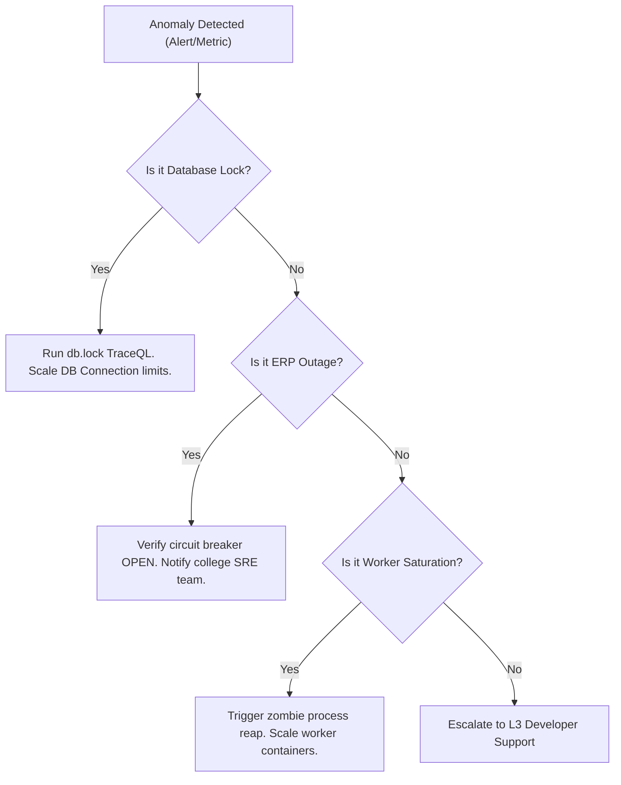

# SITAM Smart ERP — Distributed Tracing SRE Incident Runbook

This runbook guides SREs and Observability Engineers through investigating performance anomalies, debugging sync job failures, and reconstructing incident timelines across the SITAM Smart ERP platform using Grafana Tempo, Loki logs, and Prometheus metrics.

---

## 1. Trace Naming Conventions & Search Directory

All spans in the platform are normalized to standard OpenTelemetry formatting:
* **APIs**: `api.auth.login`, `api.auth.validate`, `api.attendance.fetch`
* **Caches & Queues**: `redis.command.<command>`, `redis.queue.enqueue`, `redis.queue.wait`
* **Worker Execution**: `worker.sync.execute`
* **Puppeteer Automation**: `puppeteer.pool.acquire`, `puppeteer.pool.checkout`, `puppeteer.pool.launch`, `puppeteer.erp.sync`, `puppeteer.erp.login`, `puppeteer.erp.scrapeProfile`, `puppeteer.erp.scrapeMarks`, `puppeteer.erp.scrapeFees`
* **Databases**: `db.sync.persist`, `db.<model>.<action>`
* **Outbound Alerting**: `firebase.notification.send`, `websocket.send.message`, `websocket.broadcast.message`

---

## 2. Forensic Investigation Workflows

### Outage Replay Analysis (ERP Down)
1. **Symptom**: User synchronizations fail with timeout warnings or the Circuit Breaker trips (`erp_circuit_breaker_state` gauge transitions to `0` or `1`).
2. **Tempo Search**:
   * Navigate to Grafana → Explore → Tempo.
   * Run TraceQL: `{.anomaly = true && .anomaly.type = "erp_slowdown"}` or `{.error = true && span.name =~ "puppeteer.erp.*"}`.
3. **Forensic Reconstruction**:
   * Locate the parent `puppeteer.erp.sync` trace.
   * Observe the child span `puppeteer.erp.login` or pages.
   * Inspect the `exception` events on the span to identify if the failure was a network connection error, page layout drift (unknown selector), or standard login credential issue.
4. **Mitigation**: Flip the circuit breaker state to force-fail immediately if external ERP services are down, reducing worker pool starvation.

### Queue Saturation & Backlog Storms
1. **Symptom**: Jobs are waiting in the queue for several minutes; sync latency spikes.
2. **Tempo Search**:
   * Run TraceQL: `{span.name = "redis.queue.wait" && .queue.drift_time_ms > 5000}`.
3. **Forensic Reconstruction**:
   * Open the trace containing the `redis.queue.wait` span.
   * Note the start time of the Wait span (when enqueued) and end time (when worker picked it up).
   * Check the worker metadata tags: `worker.id` and `service.instance.id` to identify which background daemons are picking up jobs.
   * If `queue.saturation_ratio` attributes on the enqueue spans are approaching `1.0` (limit 2 concurrent slots), scale horizontally.
4. **Mitigation**: Check if browser instances are leaking memory. Trigger a manual zombie process reap:
   ```bash
   curl -H "Authorization: Bearer mock-diag-token" -X POST http://localhost:3001/api/diagnostics/browsers/reap
   ```

### Worker Retry Explosions
1. **Symptom**: Repeated failed runs for the same sync request flood the system.
2. **Tempo Search**:
   * Run TraceQL: `{span.name = "worker.sync.execute" && .job.attempts > 0}`.
3. **Forensic Reconstruction**:
   * Select a retry span.
   * Inspect the OpenTelemetry **Span Links** panel. You will see a link indicating the ancestry relationship to the original failed attempt's trace.
   * Click the linked trace ID to open the previous execution timeline.
   * Inspect attributes to check if consecutive retries fail with the same exception.
4. **Mitigation**: Adjust backoff properties inside `workerService.js` or clear the dead letter queue via diagnostics API:
   ```bash
   curl -H "Authorization: Bearer mock-diag-token" -X POST http://localhost:3001/api/diagnostics/queue/cleanup
   ```

### Redis Reconnect Storms
1. **Symptom**: High database latency and command timeouts; reconnect metrics alert.
2. **Tempo Search**:
   * Run TraceQL: `{span.name = "redis.reconnect"}`.
3. **Forensic Reconstruction**:
   * Search logs in Loki: `redis_reconnect_started`.
   * Open the `redis.reconnect` trace to see how long backoffs took and how many attempts were triggered.
   * Check if PostgreSQL traces (`db.*`) show corresponding delays due to connection retries.
4. **Mitigation**: Verify the CPU/Memory utilization of the Redis container.

---

## 3. Loki Log-to-Trace Correlation (Click-Through)

1. Navigate to Grafana → Explore.
2. Select the **Loki** data source.
3. Run a query: `{service="sitam-backend"} |= "error"`.
4. In the log results list, click on any JSON formatted log containing `traceId`.
5. You will see a button labeled **Tempo** or **TraceID** next to the matched value.
6. Click the button; Grafana will open a split-screen panel displaying the exact OpenTelemetry trace timeline for that specific request, matching the parent log context.

---

## 4. SRE Escalation Playbook


